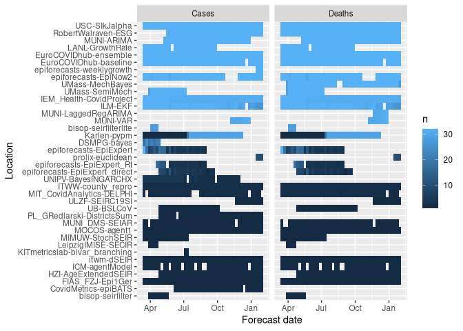
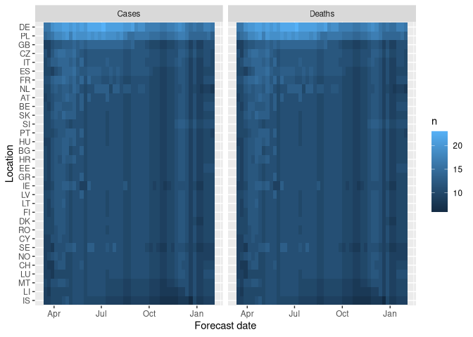
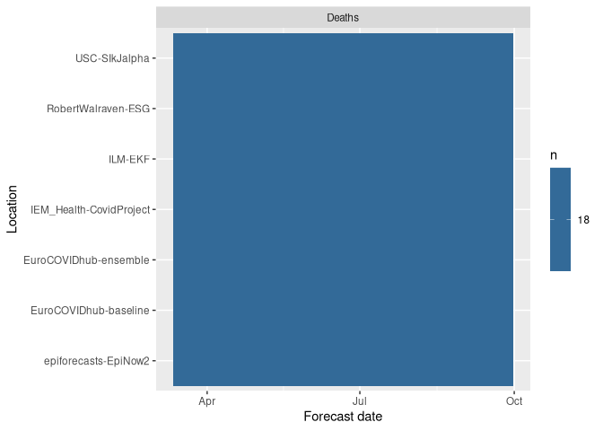
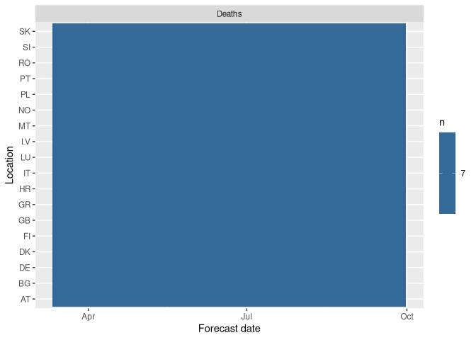
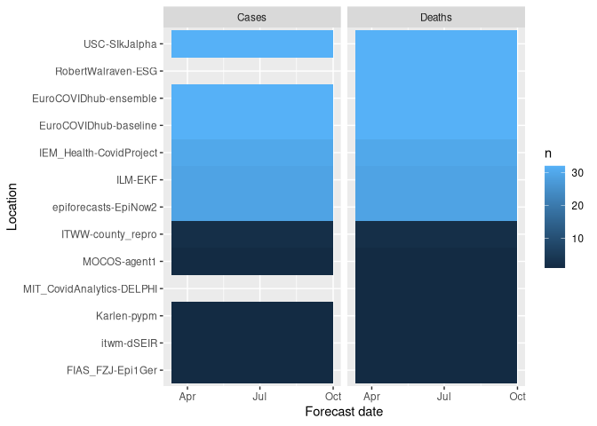
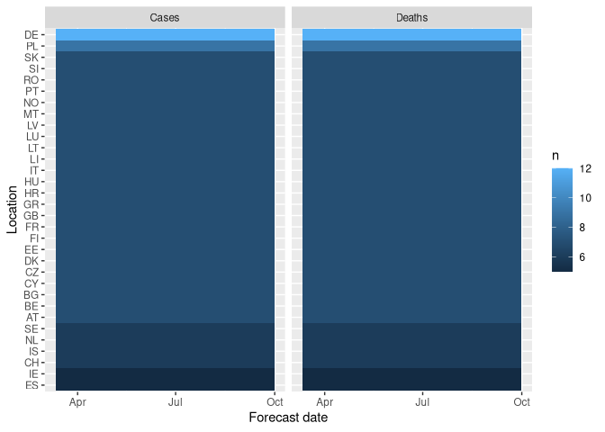

Evaluating forecasts from the ECDC Forecast Hub
================

``` r
library(dplyr)
library(here)
library(stringr)
library(data.table)
devtools::install_github("epiforecasts/scoringutils@major-update", force = FALSE)
library(scoringutils)
library(purrr)
library(tidyr)
library(ggplot2)
```

## (Possible) Objectives

## Data - Forecasts submitted to the European Forecast Hub

All forecasts are made in a quantile-based format, meaning that
forecasters provide a predictive distribution in the form of 23
quantiles (11 prediction intervals plus the median prediction),
specifying how likely they think the true observed value will fall in a
given range.

These forecasts were submitted to the [European Forecast
Hub](https://github.com/epiforecasts/covid19-forecast-hub-europe) by
different research institutions. The file contains forecasts as well as
true observations.

The data has the following columns:

| Column name     | Column prediction                                                           |
|-----------------|-----------------------------------------------------------------------------|
| location_name   | Name of the country                                                         |
| target_end_date | Date for which a forecast was made. This is always a Saturday               |
| target_type     | The target variable to be predicted, cases or deaths                        |
| true_value      | The corresponding true observed value                                       |
| population      | population of the target country                                            |
| forecast_date   | Date on which a forecast was made. This is always a Monday                  |
| quantile        | quantile-level of the predictive distribution                               |
| prediction      | Predicted value corresponding to the quantile-level specified in ‘quantile’ |
| model           | Name of the forecaster                                                      |
| target          | Summary of the prediction target variable (redundant information)           |
| horizon         | Forecast horizon                                                            |
| expert          | Whether or not a forecaster self-identified as an expert                    |

### Updating the data

To update the data, you must

1.  either use git or subversion to downlaod the data. Git only allows
    to clone the entire Forecast Hub repository, svn makes it possible
    to only download one relevant folder

``` bash
git clone https://github.com/epiforecasts/covid19-forecast-hub-europe/
```

or

``` bash
svn checkout https://github.com/epiforecasts/covid19-forecast-hub-europe/trunk/data-processed
```

Then, run the script `R/update-data-from-server.R`

``` bash
Rscript R/update-data-from-server.R
```

### Loading the data

``` r
hub_data <- rbindlist(
  list(
    fread("data/full-data-european-forecast-hub-1.csv"),
    fread("data/full-data-european-forecast-hub-2.csv"),
    fread("data/full-data-european-forecast-hub-3.csv")
  )
)
```

### Filtering data

Optionally, the Hub data can be filtered to obtain a complete set of
forecasts, as the current data set has missing forecasts:

``` r
# helper functions for visualisation
plot_models_per_loc <- function(data) {
data |>
  group_by(location, forecast_date) |>
  mutate(n = length(unique(model))) |>
  ggplot(aes(y = reorder(location, n), x = as.Date(forecast_date), fill = n)) +
  geom_tile() +
  facet_wrap(~ target_type) +
  labs(y = "Location", x = "Forecast date")
}

plot_locs_per_model <- function(data) {
data |>
  group_by(model, forecast_date) |>
  mutate(n = length(unique(location))) |>
  ggplot(aes(y = reorder(model, n), x = as.Date(forecast_date), fill = n)) +
  geom_tile() +
  facet_wrap(~ target_type) +
  labs(y = "Location", x = "Forecast date")
}
```

``` r
plot_locs_per_model(hub_data)
```

<!-- -->

``` r
plot_models_per_loc(hub_data)
```

<!-- -->

``` r
# helper function to make a complete set. The data can be either complete
# per location (meaning that different locations will have different numbers of
# models) or it can be complete overall (removing models and locations)
make_complete_set <- function(hub_data,
                              forecast_dates = c("2021-03-15",
                                                 "2021-09-27"),
                              min_locations = 19,
                              per_location = FALSE) {

  # define the unit of a single forecast
  unit_observation <- c("location", "forecast_date", "horizon",
                        "model", "target_type")

  h <- hub_data |>
    # filter out models that don't have all forecast dates
    filter(forecast_date >= forecast_dates[1],
           forecast_date <= forecast_dates[2]) |>
    group_by_at(c(unit_observation)) |>
    ungroup(forecast_date) |>
    mutate(n = length(unique(forecast_date))) |>
    ungroup() |>
    filter(n == max(n))

  # per_location means a complete set per location, meaning that every location
  # has a complete set, but the numbers of models per location may be different
  # if this is not desired, we need to restrict the models and locations

  if (!per_location) {
    h <- h|>
      # filter out models that don't have at least min_locations
      group_by_at(unit_observation) |>
      ungroup(location) |>
      mutate(n = length(unique(location))) |>
      ungroup() |>
      filter(n >= min_locations) |>
      # filter out locations that don't have a full set of forecasts
      group_by(location, target_type) |>
      mutate(n = n()) |>
      ungroup() |>
      filter(n == max(n))
  }
  return(h)
}

hub_complete <- make_complete_set(hub_data)
print(plot_locs_per_model(hub_complete))
```

<!-- -->

``` r
print(plot_models_per_loc(hub_complete))
```

<!-- -->

Or allowing different numbers of models per location:

``` r
hub_complete_loc <- make_complete_set(hub_data, per_location = TRUE)
print(plot_locs_per_model(hub_complete_loc))
```

<!-- -->

``` r
plot_models_per_loc(hub_complete_loc)
```

<!-- -->

## Methods

### Forecast evaluation

#### Proper scoring rules

Forecasts in a quantile-based forecast can be evaluated using the
[weighted interval
score](https://journals.plos.org/ploscompbiol/article?id=10.1371/journal.pcbi.1008618)
(WIS, lower values are better), a proper scoring rule. Proper scoring
rules incentivise the forecaster to state their true best belief and
cannot be ‘cheated’.

The WIS can be decomposed into three components: a penalty for
dispersion (i.e. large forecast uncertainty) as well as penalties for
over- and underprediction.

*WIS = Dispersion + Over-prediction + Under-prediction*

For a single prediction interval, the interval score is computed as
$$IS\_\\alpha(F,y) = (u-l) + \\frac{2}{\\alpha} \\cdot (l-y) \\cdot 1(y \\leq l) + \\frac{2}{\\alpha} \\cdot (y-u) \\cdot 1(y \\geq u), $$
where 1() is the indicator function, *y* is the true value, and *l* and
*u* are the $\\frac{\\alpha}{2}$ and $1 - \\frac{\\alpha}{2}$ quantiles
of the predictive distribution *F*, i.e. the lower and upper bound of a
single prediction interval. For a set of *K* prediction intervals and
the median *m*, the WIS is computed as a weighted sum,
$$WIS = \\frac{1}{K + 0.5} \\cdot (w_0 \\cdot \|y - m\| + \\sum\_{k = 1}^{K} w_k \\cdot IS\_{\\alpha}(F, y)),$$
where *w*<sub>*k*</sub> is a weight for every interval. Usually,
$w_k = \\frac{\\alpha_k}{2}$ and *w*<sub>0</sub> = 0.5

The WIS is closely related to the absolute error. Over- and
under-prediction should therefore also be understood as a form of
absolute forecasting error.

#### Forecast calibration

**Coverage** In addition to the WIS it makes sense to look at forecast
calibration in terms of interval coverage. On average, all 50% or 90%
prediction intervals should ideally cover 50% or 90% of the true
observations. By comparing nominal and empirical coverage we can quickly
determine whether a model is over- or underconfident.

**Bias** The over- and under-prediction penalties of the WIS capture
absolute forecasting errors. In addition we can examine whether a
forecast has relative tendency to over- or under-predict. This is less
susceptible to large outlier predictions

**PIT histograms**

Probability integral transform (PIT) histograms are another way of
examining forecast calibration

#### Evaluating forecasts in R

Forecasts can be evaluated in R using the `scoringutils` package.

``` r
scores <- score(hub_data) |>
  summarise_scores(by = c("model", "target_type"))

scores
```
